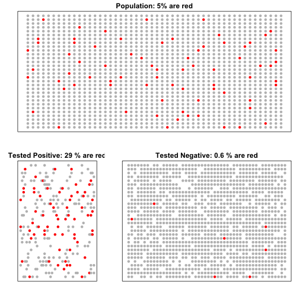
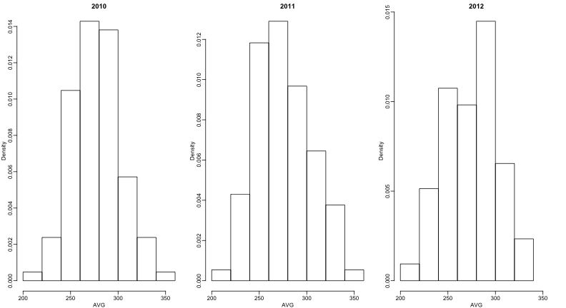

## Bayesian Statistics

One distinguishing characteristic of high-throuhgput data is that we make many measure of related outcomes. For example, we measure the expression of thousands of genes, or the height of thousands of peaks represneting protein binding, or the methyaltion levels across several CpGs. However, most of the statistical inference approach we have shown here treat each feature independently and pretty much ignores data from other features. We will learn how using statistical models we can gain power by modeling features jointly. The most succsefull of these models are what we refer to as hiearchical models which are best explained in the context of Bayesian statistics.

### Bayes theorem

We start by reviewing Bayes theorem. We do this using a hypothetical Cystic Fibrosis test as an example. Suppose a test for cystic fibrosis has an accuracy of 99%. We will use the following notation:

{$$}
\mbox{Prob}(+ \mid D=1)=0.99, \mbox{Prob}(- \mid D=0)=0.99 
{/$$}

with {$$}+{/$$} meaning a positive test and {$$}D{/$$} representing if you actually have (1) the disease or not (0).

Suppose we select random person and they test postive, what is the probability that they have the disease?  We write this as {$$}\mbox{Prob}(D=1 \mid +)?{/$$}. The  cystic fibrosis rate is 1 in 3,900 which implies that  {$$}\mbox{Prob}(D)=0.0025{/$$}. To answer this question we will use Bayes Theorem, which in general  tells us that

{$$}
\mbox{Pr}(A \mid B)  =  \frac{\mbox{Pr}(B \mid A)\mbox{Pr}(A)}{\mbox{Pr}(B)} 
{/$$}

This equation applied to our problem becomes:

{$$}
\begin{align*}
\mbox{Prob}(D=1 \mid +) & =  \frac{ P(+ \mid D=1) \cdot P(D=1)} {\mbox{Prob}(+)} \\
& =  \frac{\mbox{Prob}(+ \mid D=0)\cdot P(D)} {\mbox{Prob}(+ \mid D) \cdot P(D) + \mbox{Prob}(+ \mid D=1) \mbox{Prob}( D=0)} 
\end{align*}
{/$$}

Pluging in the numbers we get:

{$$}
\frac{0.99 \cdot 0.0025}{0.99 \cdot 0.0025 + 0.01 \cdot (.9975)}  =  0.02 
{/$$}

Note that this says that despite the test having 0.99 accuracy, the probabilty of having disease given a positive test in 0.02. This may appear counterintutive to some. The reason why this is the case is because we have to factor in the very rare probability that a person, chosen at random, has the disease. To see the 

### Simulation

The following simulation is meant help you visualize Bayes Theorem. We start by randomely selection 1500 people from a population in which the disease in question has a 5% prevalence.


```r
set.seed(3)
prev <- 1/20
##Later, we are arranging 1000 people in 80 rows and 20 columns
M <- 50 ; N <- 30
##do they have the disease?
d<-rbinom(N*M,1,p=prev)
```

Now each person gets the test which is correct 90% of the time

```r
accuracy <- 0.9
test <- rep(NA,N*M)
##do controls test positive?
test[d==1]  <- rbinom(sum(d==1), 1, p=accuracy)
##do cases test positive?
test[d==0]  <- rbinom(sum(d==0), 1, p=1-accuracy)
```

Because there are so many more controls than cases, even with low false positive rate, we get enough so that we have more controls than cases in the tested-positive group:


```r
cols <- c("grey","red")
people <- expand.grid(1:M,N:1)
allcols <- cols[d+1] ##Cases will be red

positivecols <- allcols
positivecols[test==0] <- NA ##remove non-positives

negativecols <- allcols
negativecols[test==1] <- NA ##remove non-positives

library(rafalib)
mypar()
layout(matrix(c(1,2,1,3),2,2),width=c(0.35,0.65))
###plot of all people
plot(people,col=allcols,pch=16,xaxt="n",yaxt="n",xlab="",ylab="",main=paste0("Population: ",round(mean(d)*100),"% are red"))

plot(people,col=positivecols,pch=16,xaxt="n",yaxt="n",xlab="",ylab="",main=paste("Tested Positive:",round(mean(d[test==1])*100),"% are red"))

plot(people,col=negativecols,pch=16,xaxt="n",yaxt="n",xlab="",ylab="",main=paste("Tested Negative:",round(mean(d[test==0])*100,1),"% are red"))
```

 

The proportions of red in the top plot shows {$$}\mbox{Pr}(D=1){/$$}. The bottom left shows {$$}\mbox{Pr}(D=1 \mid +){/$$} and the bottom right shows {$$}\mbox{Pr}(D=0 \mid +){/$$}.


### Bayes in Practice


<!--  -->


José Iglesias 2013

| Month | At Bats | H | AVG |
|-------|---------|---|-----|
| April | 20      | 9 | .450   |

What is your prediction for his average in October?

Note: No one has finished a 
season batting .400 since 
Ted Williams in 1941!


Distribution of AVG 

This is for all players (>500 AB) 2010, 2011, 2012


 

Average is .275 and SD is 0.027


José Iglesias’ April batting average

Should we trade him?

What is the SE of our estimate?

{$$}
\sqrt{\frac{.450 (1-.450)}{20}}=.111
{/$$}

Confidence interval?

.450-.222 to .450+.222 = .228 to .672

Hierarchichal Model

Pick a random player, then what is their batting average

{$$}\begin{align*}
\theta &\sim N(\mu, \tau^2) \mbox{ is called a prior}\\
Y \mid \theta &\sim N(\theta, \sigma^2) \mbox{ is called a sampling distribution}
\end{align*}{/$$}

Two levels of variability:

* Player to player variability
* Variability due to luck when batting

Hierarchichal Model

{$$}\begin{align*}
\theta &\sim N(\mu, \tau^2) \mbox{ is called a prior}\\
Y \mid \theta &\sim N(\theta, \sigma^2) \mbox{ is called a sampling distribution}
\end{align*}{/$$}
