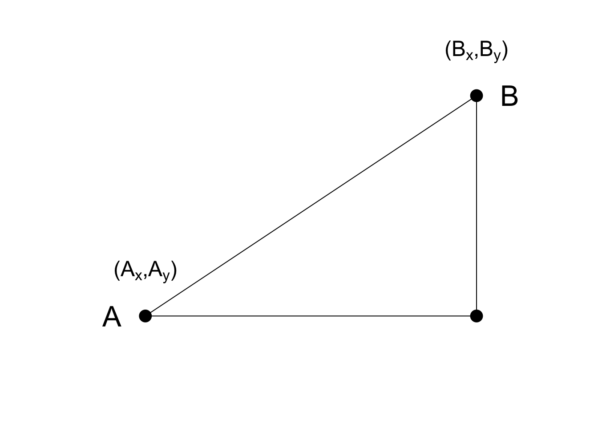

# Distance and dimension reduction

## Introduction

Many of the analysis we perform with high-dimensional data relate directly or inderictly to distance. For example many clustering and machine learning techniques rely on being able to define distance using features or predictors. The concept of distance can be generalized from  physical distance. For example, we cluster animals into groups. When we do this, we put animals that are "close" in the same group:


Any time we cluster individuals into separate groups we are, explicitely or implicitely computing a distance. 

to create _heatmaps_ a distance is computed explicitely. Heatmaps are widely used in genomics and other highthroughput fields:


[Image Source: Heatmap, Gaeddal, 01.28.2007](http://commons.wikimedia.org/wiki/File:Heatmap.png) 

In these plots the measurements, which are stored in a matrix, are represented with colors after the columns and rows have been clustered. 
Here we will learn the necessary mathematics and computing skill to understand and create heatmaps. We start by reviewing the mathematical definition of distance. 


## Euclidean Distance

As a review, let's define the distance between two points, {$$}A{/$$} and {$$}B{/$$}, on a cartesian plane.

 

The euclidean distance between {$$}A{/$$} and {$$}B{/$$} is simply

{$$}\sqrt{ (A_x-B_x)^2 + (A_y-B_y)^2}{/$$}


## Distance in high dimensions

We introduce a data set with gene expression measurements for 22,215 genes from 189 samples. The R ojects can be downloaded like this:


```r
library(devtools)
install_github("genomicsclass/tissuesGeneExpression")
```

The data represent RNA expression levels for eight tissues, each with several individuals.


```r
library(tissuesGeneExpression)
data(tissuesGeneExpression)
dim(e) ##e contains the expression data
```

```
## [1] 22215   189
```

```r
table(tissue) ## tissue[i] tells us what tissue is represented by e[,i]
```

```
## tissue
##  cerebellum       colon endometrium hippocampus      kidney       liver 
##          38          34          15          31          39          26 
##    placenta 
##           6
```

We are interested in describing distance between samples in the context of this dataset. We might also be interested in finding genes that _behave similarly_ across samples.

To define distance we need to know what points are since mathematical distance is computed between points. With high dimensional data, points are no longer on the cartesian plan. Instead they are in higher dimensions. For example, sample {$$}i{/$$} is defined by a point in 22,215 dimesional space: {$$}(Y_{1,i},\dots,Y_{22215,i})^\top{/$$}. Feature {$$}g{/$$} is defined by a point in 189 dimensions {$$}(Y_{g,189},\dots,Y_{g,189})^\top{/$$}

Once we define points, the Euclidean distance is defined in a very similar way as it is defined for two dimensions. For example, the  distance between two samples {$$}i{/$$} and {$$}j{/$$} is

{$$}
d(i,j) = \sqrt{ \sum_{g=1}^{22215} (Y_{g,i}-Y_{g,j })^2 }
{/$$}

and the distance between two features {$$}h{/$$} and {$$}g{/$$} as:
{$$}
d(h,g) = \sqrt{ \sum_{i=1}^{189} (Y_{h,i}-Y_{g,i})^2 }
{/$$}


### Distance with Matrix Algebra

The distance between samples {$$}i{/$$} and {$$}j{/$$} can be written as

{$$} d(i,j) = (\mathbf{Y}_i - \mathbf{Y}_j)^\top(\mathbf{Y}_i - \mathbf{Y}_j){/$$}

With {$$}\mathbf{Y}_i{/$$} and {$$}\mathbf{Y}_j{/$$} coliumns {$$}i{/$$} and {$$}j{/$$}. This result can be very convinient in practice as computations can be made much faster using matrix multiplication.

### Examples

We can now use the formulas above to compute distance. Let's compute distance between samples 1 and 2, both kidneys, and then to 87, a colon.


```r
x <- e[,1]
y <- e[,2]
z <- e[,87]
sqrt(sum((x-y)^2))
```

```
## [1] 85.8546
```

```r
sqrt(sum((x-z)^2))
```

```
## [1] 122.8919
```

As expected the kidneys are closer to each other. A faster way to compute this is using matrix algebra


```r
sqrt( crossprod(x-y) )
```

```
##         [,1]
## [1,] 85.8546
```

```r
sqrt( crossprod(x-z) )
```

```
##          [,1]
## [1,] 122.8919
```

Now to compute all the distances at once we have the function `dist`. Because it computes the distance between each row, and here we are interested in the distance between samples we transpose the matrix


```r
d <- dist(t(e))
class(d)
```

```
## [1] "dist"
```

Note that this produces the an object of class `dist` and to access to entries we need to coerce into a matrix:


```r
as.matrix(d)[1,2]
```

```
## [1] 85.8546
```

```r
as.matrix(d)[1,87]
```

```
## [1] 122.8919
```

It is important to keep in mind that if we run `dist` on `e` it will compute all pairwise distances between genes. This will try to create a {$$}22215 \times 22215{/$$} matrix that may kill crash your R sessions.


