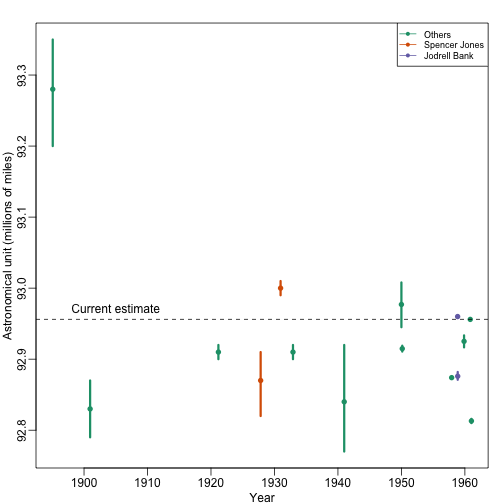

# Batch Effects

One often overlooked complication with high-throughput studies is batch effects, which occur because measurements are affected by laboratory conditions, reagent lots and personnel differences. This becomes a major problem when batch effects are confounded with an outcome of interest and lead to incorrect conclusions. In this chapter we describe batch effects in detail: how to detect, interprete, model, and adjust for batch effects.

Batch effects are the biggest challenge faced by genomics research, especially in precision medicine. The precense of batch effects in onr form or another have been reported among most if not all high-throughput technologies [Leet et all (2010) Nature Reviews Genetics 11, 733-739]. But batch effects are not specific to genomics technology. In fact, in a 1972 paper, WJ Youden describes batch effects in the context of measurements made by physicists. He pointed out the "subjective character of present estimates" of physical constants and how they changed from laboratory to laboratory. For example, Table 1 of that paper shows the following estimates of the astronomical unit from different laboratories. The reports included an estimate of spread (what we could a confidence interval)

 

Judging by the variability across labs and the fact that the reported bounds don't cover this variabilty shows very clearly that each group of measurement includes a bias that is consistent within group but not across. We call this a batch effect. Note that there are laboratories that reported two estimates (purple and orange) and batch effects are seen here as well. 

We can write down a statistical model for these observations. The scientists making these measuremenst assumed they observed:

{$$}
Y_{i,j} = \mu + \varepsilon_{ij}
{/$$}

with {$$}Y_{ij}{/$$} the {$$}j{/$$}-th measurement of laboratory {$$}i{/$$}, {$$}\mu{/$$} the true physical constant, and {$$}\varepsilon_{ij}{/$$} independent measurement errod. To account for the variability introduced by {$$}\varepsilon_{ij}{/$$}, we compute standard errors from the data. However, this model does not fit the data because each lab seems to have a different center. So a better model is

{$$}
Y_{i,j} = \mu + \gamma_i + \varepsilon_{ij}
{/$$}

with {$$}\gamma_i{/$$} a laboratory specific bias or _batch effect_. 

From the plot it is quite clear that the variability of {$$}\gamma{/$$} across laboratories is larger than the variability of {$$}\varepsilon{/$$} and lab. The problem is that one can't estimate {$$}\gamma_i{/$$} using data from a single lab as it can't be distinguihsed from {$$}\mu{/$$}. Not only after we collect data from several laboratories do we realize the variability introduced by {$$}\gamma{/$$}.

Youden's paper also includes batch effect examples from more recent estimates of the speed of light as well as estimates of the gravity constant. Here we demonstrate the widespread presence and complex nature of batch effects in high-thorugput biological measurements. 

