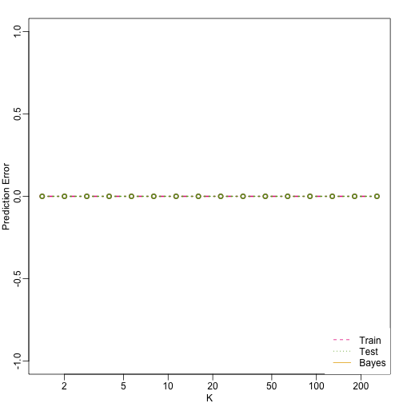

## Class Prediction

Here we give brief introduction to the main machine learning topic: class predictio. In fact, many refer to class prediction as machine learnine and we actually use the two terms interchangibly. Some of the examples we give follow examples from the book The Elements of Statistical Learning: Data Mining, Inference, and Prediction, by Trevor Hastie, Robert Tibshirani and Jerome Friedman. A free PDF of this book can be found at the following URL:

<http://statweb.stanford.edu/~tibs/ElemStatLearn/>

Similar to inference in the context of regression, Machine Learning (ML) studies the relationships between outcomes {$$}Y{/$$} and covariates {$$}X{/$$}. In ML we call {$$}X{/$$} the predictors. The main difference between ML and inference is that in ML we are interested in predicting {$$}Y{/$$} using {$$}X{/$$}. Statistical models are used, but while in inference we estimate and interpret model parameters, in ML they are mainly a means to an end: predicting {$$}Y{/$$}. 

Here we introduce the main concepts needed to understand ML along with two specific algorithms: regression and k nearest neighbors (knn). Note there are dozens of popular algorithms that we do not cover here are some 

In a previous section we covered the very simple one-predictor case. Most of ML is concerned with cases with more than one predictor. For illustration purposes we move to a case in which {$$}X{/$$} is two dimensional and {$$}Y{/$$} is binary. We simulate a situation with a non-linear relationship using an example from Hastie, Tibshirani and Friedman's book. In the plot below we show the actual values of {$$}f(x_1,x_2)=E(Y \mid X_1=x_1,X_2=x_2){/$$} using colors


```
## Error in rev(brewer.pal(11, "Spectral")): could not find function "brewer.pal"
```

```
## Error in eval(expr, envir, enclos): object 'hmcol' not found
```

```
## Error in eval(expr, envir, enclos): could not find function "mvrnorm"
```

```
## Error in rbind(mvrnorm(3, c(1, 1), s2 * diag(2)), mvrnorm(3, c(0, 1), : could not find function "mvrnorm"
```

```
## Error in makeX(M0): object 'M0' not found
```

```
## Error in makeX(M0): object 'M0' not found
```

```
## Error in makeX(M1): object 'M1' not found
```

```
## Error in makeX(M1): object 'M1' not found
```

```
## Error in rbind(x0, x1): object 'x0' not found
```

```
## Error in rbind(testx0, testx1): object 'testx0' not found
```

```
## Error in eval(expr, envir, enclos): object 'mycols' not found
```

```
## Error in eval(expr, envir, enclos): object 'cols' not found
```

```
## Error in eval(expr, envir, enclos): object 'x' not found
```

```
## Error in seq(XLIM[1], XLIM[2], len = GS): object 'XLIM' not found
```

```
## Error in eval(expr, envir, enclos): object 'x' not found
```

```
## Error in seq(YLIM[1], YLIM[2], len = GS): object 'YLIM' not found
```

```
## Error in expand.grid(tmpx, tmpy): object 'tmpx' not found
```

```
## Error in apply(newx, 1, p): object 'newx' not found
```

```
## Error in eval(expr, envir, enclos): object 'bayesrule' not found
```

```
## Error in eval(expr, envir, enclos): object 'hmcol' not found
```

```
## Error in eval(expr, envir, enclos): could not find function "mypar2"
```

```
## Error in plot(x, type = "n", xlab = "X1", ylab = "X2", xlim = XLIM, ylim = YLIM): object 'x' not found
```

```
## Error in points(newx, col = colshat, pch = 16, cex = 0.35): object 'newx' not found
```

If we should {$$}E(Y \mid X=x)>0.5{/$$} in red and the rest in blue we see the boundary region in which we switch from predicting from 0 to 1.


```
## Error in eval(expr, envir, enclos): could not find function "mypar2"
```

```
## Error in eval(expr, envir, enclos): object 'mycols' not found
```

```
## Error in eval(expr, envir, enclos): object 'mycols' not found
```

```
## Error in plot(x, type = "n", xlab = "X1", ylab = "X2", xlim = XLIM, ylim = YLIM): object 'x' not found
```

```
## Error in points(newx, col = colshat, pch = 16, cex = 0.35): object 'newx' not found
```

```
## Error in contour(tmpx, tmpy, matrix(round(bayesrule), GS, GS), levels = c(1, : object 'tmpx' not found
```

The above plots relate to the "truth" that we do not get to see. A typical first step in an ML is to use a sample to estimate {$$}f(x){/$$} 

Now make a plot of training data and test data

```r
plot(x,pch=21,bg=cols,xlab="X1",ylab="X2",xlim=XLIM,ylim=YLIM)
```

```
## Error in plot(x, pch = 21, bg = cols, xlab = "X1", ylab = "X2", xlim = XLIM, : object 'x' not found
```

We will review two specif ML techniques. First, we need to review the main concept we use to evaluate the performance of these methods. 

### Training and Test sets

In the code above you will notice that we created two sets data""


```r
x0 <- makeX(M0)##the final values for y=0 (green)
testx0 <- makeX(M0)
x1 <- makeX(M1)
testx1 <-makeX(M1)
x <- rbind(x0,x1) ## one matrix with everything
test <- rbind(testx0,testx1)
```

You will notice that the test and train set have similar global properties as they were generated by the same random variables (more blue towards the bottom right) but are, by construction, different. 

```r
mypar2(1,2)
```

```
## Error in eval(expr, envir, enclos): could not find function "mypar2"
```

```r
plot(x,pch=21,bg=cols,xlab="X1",ylab="X2",xlim=XLIM,ylim=YLIM)
```

```
## Error in plot(x, pch = 21, bg = cols, xlab = "X1", ylab = "X2", xlim = XLIM, : object 'x' not found
```

```r
plot(test,pch=21,bg=colstest,xlab="X1",ylab="X2",xlim=XLIM,ylim=YLIM)
```

```
## Error in plot(test, pch = 21, bg = colstest, xlab = "X1", ylab = "X2", : object 'test' not found
```

The reason for this is to detect over-training  by testing on a different data than the one used to fit  model. We will see how important this is.


### Predicting with regression


A first naive approach to this ML problem is to fit a two variable linear regression model:


```r
X1 <- x[,1] ##these are the covariates
```

```
## Error in eval(expr, envir, enclos): object 'x' not found
```

```r
X2 <- x[,2] 
```

```
## Error in eval(expr, envir, enclos): object 'x' not found
```

```r
fit1 <- lm(y~X1+X2)
```

```
## Error in eval(expr, envir, enclos): object 'X1' not found
```

Once we the fitted values we can estimate {$$}f(x_1,x_2){/$$} with {$$}\hat{f}(x_1,x_2)=\hat{\beta}_0 + \hat{\beta}_1x_1 +\hat{\beta}_2{/$$}. When predicting 1s and 0s we simply predict 1 when {$$}\hat{f}(x_1,x_2)>0.5{/$$}. We now examine the error rates in the test and training sets and also plot the boundary region:


```r
##prediction on train
yhat <- predict(fit1)
```

```
## Error in predict(fit1): object 'fit1' not found
```

```r
yhat <- as.numeric(yhat>0.5)
```

```
## Error in eval(expr, envir, enclos): object 'yhat' not found
```

```r
cat("Linear regression prediction error in train:",1-mean(yhat==y),"\n")
```

```
## Error in mean(yhat == y): object 'yhat' not found
```

We can quickly obtain predicted values for any set of values using the `predict` function:


```r
yhat <- predict(fit1,newdata=data.frame(X1=newx[,1],X2=newx[,2]))
```

```
## Error in predict(fit1, newdata = data.frame(X1 = newx[, 1], X2 = newx[, : object 'fit1' not found
```

Now we can obtain a plot showing where we predict 1s and where we predict 0 as well as the boundary. We can also use the `predict` function to obtain predicted values for our test set. Note that nowhere do we fit the model on the test set: 


```r
colshat <- yhat
```

```
## Error in eval(expr, envir, enclos): object 'yhat' not found
```

```r
colshat[yhat>=0.5] <- mycols[2]
```

```
## Error in eval(expr, envir, enclos): object 'mycols' not found
```

```r
colshat[yhat<0.5] <- mycols[1]
```

```
## Error in eval(expr, envir, enclos): object 'mycols' not found
```

```r
m <- -fit1$coef[2]/fit1$coef[3] #boundary slope
```

```
## Error in eval(expr, envir, enclos): object 'fit1' not found
```

```r
b <- (0.5 - fit1$coef[1])/fit1$coef[3] #boundary intercept
```

```
## Error in eval(expr, envir, enclos): object 'fit1' not found
```

```r
##prediction on test
yhat <- predict(fit1,newdata=data.frame(X1=test[,1],X2=test[,2]))
```

```
## Error in predict(fit1, newdata = data.frame(X1 = test[, 1], X2 = test[, : object 'fit1' not found
```

```r
yhat <- as.numeric(yhat>0.5)
```

```
## Error in eval(expr, envir, enclos): object 'yhat' not found
```

```r
cat("Linear regression prediction error in test:",1-mean(yhat==ytest),"\n")
```

```
## Error in mean(yhat == ytest): object 'yhat' not found
```

```r
plot(test,type="n",xlab="X1",ylab="X2",xlim=XLIM,ylim=YLIM)
```

```
## Error in plot(test, type = "n", xlab = "X1", ylab = "X2", xlim = XLIM, : object 'test' not found
```

```r
abline(b,m)
```

```
## Error in abline(b, m): object 'b' not found
```

```r
points(newx,col=colshat,pch=16,cex=0.35)
```

```
## Error in points(newx, col = colshat, pch = 16, cex = 0.35): object 'newx' not found
```

```r
points(test,bg=cols,pch=21)
```

```
## Error in points(test, bg = cols, pch = 21): object 'test' not found
```

Note that the error rates in the test and train sets are quite similar. Thus do not seem to be over-training. This is not surprising as we are fitting a 2 parameter model to 400 data points. However note that the boundary is a line. Because we are fitting plane to the data, there is no other option here. The linear regression method is too rigid. The rigid makes it stable and avoids over training but it also keeps the model from adapting to the non-linear relationship between {$$}Y{/$$} and {$$}X{/$$}. We saw this before in the smoothing section. The next ML technique we consider is similar to the smoothing techniques described before.

<a name="knn"></a>

### K-nearest neighbor

K-nearest neighbors (kNN) is similar to bin smoothing but it is easier to adapt to multiple dimensions. Basically for any point {$$}x{/$$} for which we want an estimate we look for the k nearest points and then take an average. We can now control flexibility through  {$$}k{/$$}. Here we compare {$$}k=1{/$$} and {$$}k=100{/$$}.


```r
library(class)
mypar2(2,2)
```

```
## Error in eval(expr, envir, enclos): could not find function "mypar2"
```

```r
for(k in c(1,200)){
  cat(k,"nearest neighbors\n")
  
  ##predict on train
  yhat <- knn(x,x,y,k=k)
  cat("KNN prediction error in train:",1-mean((as.numeric(yhat)-1)==y),"\n")
  
##make plot
  yhat <- knn(x,newx,y,k=k)
  colshat <- mycols[as.numeric(yhat)]
  
  plot(x,type="n",xlab="X1",ylab="X2",xlim=XLIM,ylim=YLIM)
  points(newx,col=colshat,cex=0.35,pch=16)
  contour(tmpx,tmpy,matrix(as.numeric(yhat),GS,GS),levels=c(1,2),add=TRUE,drawlabels=FALSE)
  points(x,bg=cols,pch=21)
  title(paste("Train: KNN (",k,")",sep=""))
  
  plot(test,type="n",xlab="X1",ylab="X2",xlim=XLIM,ylim=YLIM)
  points(newx,col=colshat,cex=0.35,pch=16)
  contour(tmpx,tmpy,matrix(as.numeric(yhat),GS,GS),levels=c(1,2),add=TRUE,drawlabels=FALSE)
  points(test,bg=cols,pch=21)
  title(paste("Test: KNN (",k,")",sep=""))
  
  yhat <- knn(x,test,y,k=k)
  cat("KNN prediction error in test:",1-mean((as.numeric(yhat)-1)==y),"\n")
}
```

```
## 1 nearest neighbors
```

```
## Error in as.matrix(train): object 'x' not found
```

Note that when {$$}k=1{/$$} we make no mistakes in the training test since every point is it's closes neighbor and it is equal to itself. Note that the we some islands of blue in the red area that once we move to the test set are more error prone. In the case {$$}k=100{/$$} we do not have this problem and we also see that we improve over linear regression

### Bayes Rule
Here is a comparison of the test and train set errors for various values of {$$}k{/$$}. We also include the error rate that we would make if we actually knew {$$}\mbox{E}(Y \mid X_1=x1,X_2=x_2){/$$} referred to as _Bayes Rule_


```r
###Bayes Rule
yhat <- apply(test,1,p)
```

```
## Error in apply(test, 1, p): object 'test' not found
```

```r
cat("Bayes rule prediction error in train",1-mean(round(yhat)==y),"\n")
```

```
## Error in mean(round(yhat) == y): object 'yhat' not found
```

```r
bayes.error=1-mean(round(yhat)==y)
```

```
## Error in mean(round(yhat) == y): object 'yhat' not found
```

```r
train.error <- rep(0,16)
test.error <- rep(0,16)
for(k in seq(along=train.error)){
  cat(k,"nearest neighbors\n")
  
  ##predict on train
  yhat <- knn(x,x,y,k=2^(k/2))
  train.error[k] <- 1-mean((as.numeric(yhat)-1)==y)
  
  yhat <- knn(x,test,y,k=2^(k/2))
  test.error[k] <- 1-mean((as.numeric(yhat)-1)==y)
}
```

```
## 1 nearest neighbors
```

```
## Error in as.matrix(train): object 'x' not found
```

```r
ks <- 2^(seq(along=train.error)/2)
mypar()
plot(ks,train.error,type="n",xlab="K",ylab="Prediction Error",log="x",ylim=range(c(test.error,train.error)))
lines(ks,train.error,type="b",col=4,lty=2,lwd=2)
lines(ks,test.error,type="b",col=5,lty=3,lwd=2)
abline(h=bayes.error,col=6)
```

```
## Error in int_abline(a = a, b = b, h = h, v = v, untf = untf, ...): object 'bayes.error' not found
```

```r
legend("bottomright",c("Train","Test","Bayes"),col=c(4,5,6),lty=c(2,3,1),box.lwd=0)
```

 


