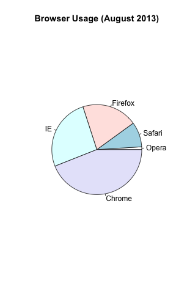

--- 
title: "Plots to avoid" 
output: html_document 
layout: page 
--- 


## Plots to Avoid 

This section is based on talk by [Karl W. Broman](http://kbroman.org/) titled "How to Display Data Badly" in which he described how the default plots offered by Microsoft Excel "obscure your data and annoy your readers" ([here](http://kbroman.org/pages/talks.html) is a link to a collection of Karl Broman's talks). His lecture was inspired by the 1984 paper by H Wainer: How to display data badly. American Statistician 38(2): 137--147. Dr. Wainer was the first to elucidate the principles of the bad display of data. But according to Karl, "The now widespread use of Microsoft Excel has resulted in remarkable advances in the field." Here we show examples of "bad plots" and how to improve them in R. 

### General Principles 

General principles 

The aims of good data graphics is to display data accurately and clearly. Some rules for displaying data badly: 

* Display as little information as possible. 
* Obscure what you do show (with chart junk). 
* Use pseudo-3d and color gratuitously. 
* Make a pie chart (preferably in color and 3d). 
* Use a poorly chosen scale. 
* Ignore significant figures. 


### Piecharts 


Say we want the report the results from a poll asking about browser preference (taken in August 2013). The standard way of displaying these is with a piechart: 


```r 
pie(browsers,main="Browser Usage (August 2013)") 
``` 

 

But as stated by the help file for the `pie` function: 
