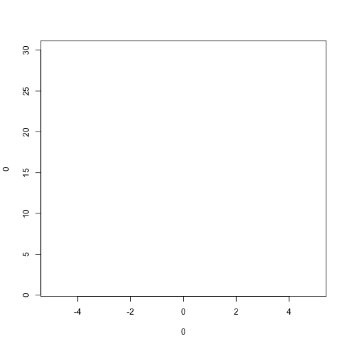
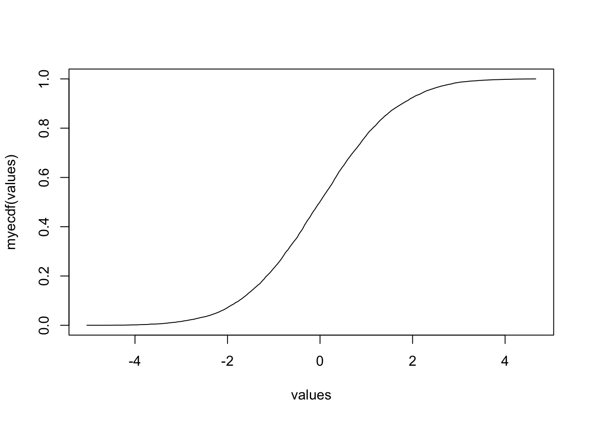
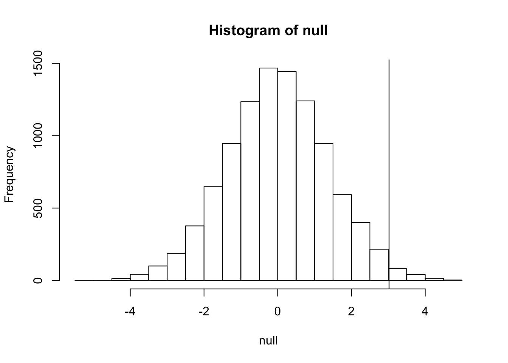

---
layout:page
title:Introductiontorandomvariables
---


#Inference

<aname="introduction"></a>


##Introduction


Thiscourseintroducesthestatisticalconceptsnecessarytounderstandp-valuesandconfidenceintervals.Thesetermsareubiquitousinthelifescienceliterature.Let'slookat[thispaper](http://diabetes.diabetesjournals.org/content/53/suppl_3/S215.full])asanexample.

Notethattheabstracthasthisstatement:

>"Bodyweightwashigherinmicefedthehigh-fatdietalreadyafterthefirstweek,duetohigherdietaryintakeincombinationwithlowermetabolicefficiency".

Tobackthisuptheyprovidethisintheresultssection:

>"Alreadyduringthefirstweekafterintroductionofhigh-fatdiet,bodyweightincreasedsignificantlymoreinthehigh-fatdiet–fedmice(+1.6±0.1g)thaninthenormaldiet–fedmice(+0.2{$$}\pm{/$$}0.1g;P<0.001)."

WhatdoesP<0.001mean?Whatare{$$}\pm{/$$}included?InthisclasswewilllearnwhatthismeanandlearntocomputethesevaluesinR.Thefirststepistounderstandwhatisarandomvariable.Tounderstandthis,wewillusedatafromamousedatabase(providedbyKarenSvensonviaGaryChurchillandDanGattiandPartiallyfundedbyP50GM070683.)WewillimportthedatawithRandexplainrandomvariablesandnulldistributionsusingRprogramming.

Ifyouhavethefileinyourworkingdirectoryyoucanreaditwithjustoneline.

```r
dat=read.csv("femaleMiceWeights.csv")
```

###Ourfirstlookatdata

Weareinterestedindeterminingiffollowingagivendietmakesmiceheavierafterseveralweeks.Thisdatawasproducedbyordering24micefromJacksonLab,randomlyassigningeitherchoworhighfat(hf)diet.Thenafterseveralweeksweweighedeachmiceandobtainedthisdata:


```r
dat
```

```
##DietBodyweight
##1chow21.51
##2chow28.14
##3chow24.04
##4chow23.45
##5chow23.68
##6chow19.79
##7chow28.40
##8chow20.98
##9chow22.51
##10chow20.10
##11chow26.91
##12chow26.25
##13hf25.71
##14hf26.37
##15hf22.80
##16hf25.34
##17hf24.97
##18hf28.14
##19hf29.58
##20hf30.92
##21hf34.02
##22hf21.90
##23hf31.53
##24hf20.73
```

Soarethehfmiceheavier?Notethatmouse24at20.73gramsisonethelightestmicewhile21at34.02isoneoftheheaviest.Bothareonthehfdiet.Justfromlookingatthedataweseethereis*variability*.Claimssuchastheoneaboveusuallyrefertotheaverages.Solet'slookattheaverageofeachgroup:


```r
library(dplyr)
control<-filter(dat,Diet=="chow")%>%select(Bodyweight)%>%unlist
treatment<-filter(dat,Diet=="hf")%>%select(Bodyweight)%>%unlist
print(mean(treatment))
```

```
##[1]26.83417
```

```r
print(mean(control))
```

```
##[1]23.81333
```

```r
diff<-mean(treatment)-mean(control)
print(diff)
```

```
##[1]3.020833
```

Sothehfdietmiceareabout10%heavier.Arewedone?Whydoweneedp-valuesandconfidenceintervals?Thereasonisthattheseaveragesarerandomvariables.Theycantakemanyvalues.

Notethatwerepeattheexperiment,wewillobtain24newmicefromJacksonLaboratoriesandwhenwerandomlyassignthemtoeachdietwewillgetadifferentmean.Everytimewerepeatthisexperimentwegetadifferentvalue.Wecallthistypequantitya*randomvariable*.

<aname="random_variable"></a>

##Randomvariables

Let'sseewhatarandomvariableis.ImagineweactuallyhavetheweightofallcontrolfemalemiceandcanloadthemuptoR.InStatisticswerefertothisas*thepopulation*.Theseareallthecontrolmiceavailablefromwhichwesampled24.Notethatinpracticewedonothaveaccesstothepopulation.Wehaveaspecialdatasetthatwe'reusingheretoillustrateconcepts.

Readinthedata,eitherfromyourhomedirectoryorfromdagdata:

```r
library(downloader)
url<-"https://raw.githubusercontent.com/genomicsclass/dagdata/master/inst/extdata/femaleControlsPopulation.csv"
filename<-"femaleControlsPopulation.csv"
if(!file.exists(filename))download(url,destfile=filename)
population<-read.csv(filename)
population<-unlist(population)#turnitintoanumeric
```

Nowlet'ssample12micethreetimesandseehowtheaveragechanges.


```r
control<-sample(population,12)
mean(control)
```

```
##[1]24.11333
```

```r
control<-sample(population,12)
mean(control)
```

```
##[1]24.40667
```

```r
control<-sample(population,12)
mean(control)
```

```
##[1]23.84
```

Notehowtheaveragevaries.Wecancontinuetodothisoverandoveragainandstartlearningsomethingaboutthe...

<aname="null_distribution"></a>

##Nulldistributions

Nowlet'sgobacktoouraveragedifferenceof`diff`.Asscientistsweneedtobeskeptics.Howdoweknowthatthis`diff`isduetothediet.Whathappensifwegiveall24thesamediet,canweseeadifferencethisbig?Statisticiansrefereedtothisscenarioasthe*nullhypothesis*.Thenamenullisusedtoremindusthatweareactingasskeptics:wegivecredencetothepossibilitythatthereisnodifference.

Becausewehaveaccesstothepopulation,wecanactuallyobserveasmanyvaluesaswewanttoofthedifferenceoftheaverageswhenthediethasnoeffect.Wecandothisbysampling24controlmice,givingthemthesamediet,andthenrecordingthedifferenceinmeanbetweentorandomlysplitgroups.Hereisthecode:


```r
###12controlmice
control<-sample(population,12)
##another12controlmicethatweactasiftheywerenot
treatment<-sample(population,12)
print(mean(treatment)-mean(control))
```

```
##[1]0.5575
```

Nowlet'sdoit10,000times.Wewilluseafor-loop,anoperationthatletsusautomatizethis


```r
n<-10000
null<-vector("numeric",n)
for(iin1:n){
control<-sample(population,12)
treatment<-sample(population,12)
null[i]<-mean(treatment)-mean(control)
}
```

Thevaluesin`null`formwhatwecallthe*nulldistribution*.Wewilldefinethismoreformallybelow.

Sowhatpercentarebiggerthan`diff`?

```r
mean(null>=diff)
```

```
##[1]0.0138
```

Only1.5%.Sowhatdoweconcludeasskeptics.Whenthereisnodieteffect,weseevaluea`diff`asbigastheoneweobservedonly1.5%ofthetime.Notethatthisiswhatisknownasap-valuewhichwewillalsodefinemoreformallylater

##Illustrationofthenulldistribution

Let'srepeattheloopabovebutthistimelet'saddapointtothefigureeverytimewere-runtheexperiment


```r
n<-100
plot(0,0,xlim=c(-5,5),ylim=c(1,30),type="n")
totals<-vector("numeric",11)
for(iin1:n){
control<-sample(population,12)
treatment<-sample(population,12)
nulldiff<-mean(treatment)-mean(control)
j<-pmax(pmin(round(nulldiff)+6,11),1)
totals[j]<-totals[j]+1
text(j-6,totals[j],pch=15,round(nulldiff,1))
##if(i<15)scan()##Youcanaddthislinetointeractivelyseevaluesappear
}
```



<aname="distributions"></a>

##Distributions

Wehaveexplainedwhatwemeanby*null*inthecontextofnullhypothesisbutwhatexactlyisadistribution?
Thesimplestwaytothinkofa*distribution*isasacompactdescriptionofmanynumbers.Forexample,intheprevioussectionwedefinedanobject'null'with10,000averagedifferencescreatedunderthenull.Todefineadistributionwecompute,forallpossiblevaluesof{$$}a{/$$}theproportionofnumbersinourlistthatarebelow{$$}a{/$$}.Weusethefollowingnotation

{$$}F(a)\equiv\mbox{Pr}(x\leqa){/$$}

Thisiscalledtheempiricalcumulativedistributionfunction.Wecanplot{$$}F(a){/$$}versus{$$}a{/$$}likethis


```r
values<-seq(min(null),max(null),len=300)
myecdf<-ecdf(null)
plot(values,myecdf(values),type="l")
```



The`ecdf`functionisnottypicalandwewon'tdiscussithere.Furthermore,theseecdfsareactuallynotaspopularashistogramswhichgiveusthesameinformationbutshowustheproportionofvaluesinintervals

{$$}\mbox{Pr}(a\leqx\leqb)=F(b)-F(a){/$$}

Thisisamoreusefulplotbecauseweareusuallymoreinterestedinintervals.Itisalsoeasiertodistinguishdifferenttypes(families)ofdistributionsbylookingathistograms.

Notethatfromthehistogramwecanseethatvaluesaslargeas`diff`arerelativelyrare

```r
hist(null)
abline(v=diff)
```



Wewillprovidemoredetailsonhistogramsinlaterchapters.

Animportantpointtokeepinmindhereisthatwhilewedefined{$$}Pr(a){/$$}bycountingcases,wewilllearnhow,insomecircumstances,mathematicsgivesusformulasfor{$$}Pr(a){/$$}thatsaveusthetroubleofcomputingthemaswedidhere.

<aname="normal_distribution"></a>

##Normaldistribution

Ifinsteadofthetotalnumberswereporttheproportions,thenthehistogramisaprobabilitydistribution.Theprobabilitydistributionweseeaboveapproximatesonethatisverycommoninanature:thebellcurveornormaldistributionorGaussiandistribution.Whenthehistogramofalistofnumbersapproximatesthenormaldistributionwecanuseaconvenientmathematicalformulatoapproximatetheproportionofindividualsinanygiveninterval

{$$}
\mbox{Pr}(a<x<b)=\int_a^b\frac{1}{\sqrt{2\pi\sigma^2}}\exp{\left(\frac{-(x-\mu)^2}{2\sigma^2}\right)}\,dx
{/$$}

Here{$$}\mu{/$$}and{$$}\sigma{/$$}arerefereedtoasthemeanandstandarddeviation.Ifthisapproximationholdsforourlistthenthepopulationmeanandvarianceofourlistcanbeusedintheformulaabove.Toseethiswithanexamplerememberthatabovewenotedthatonly1.5%ofvaluesonthenulldistributionwereabove`diff`.Wecancomputetheproportionofvaluesbelowavalue`x`with`pnorm(x,mu,sigma)`withoutknowingallthevalues.Thenormalapproximationworksverywellhere:


```r
1-pnorm(diff,mean(null),sd(null))
```

```
##[1]0.01391929
```

Laterwewilllearnthereisamathematicalexplanationforthis.Averyusefulcharacteristicofthisapproximationisthatoneonlyneedstoknow{$$}\mu{/$$}and{$$}\sigma{/$$}todescribetheentiredistribution.Fromthiswecancomputetheproportionofvaluesinanyinterval.

###Summary

Sothiswasprettyeasyno?Butwhyarewenotdone?NotethattomakethiscalculationwedidtheequivalentofbuyingallthemiceavailablefromJacksonlaboratoriesandperformedourexperimentoverandoveragaintodefinethenulldistribution.Thisisnotsomethingwecandoinpractice.StatisticalInferenceisthemathematicaltheorythatpermitsyoutoapproximatethiswithonlythedatafromyoursample,i.e.theoriginal24mice.Thisiswhatwewilllearninthefollowingsections.

